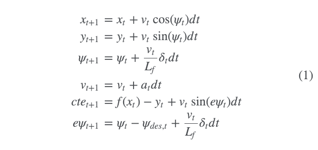

# Udacity Model Predictive Control Project - Self Driving Car Nanodegree

The goal of this project is to navigate a track in a Udacity-provided [simulator](https://github.com/udacity/self-driving-car-sim/releases), 
which communicates telemetry and track waypoint data via websocket, 
by sending steering and acceleration commands back to the simulator. 
The solution must be robust to 100ms latency, as one may encounter in real-world application.

This solution, as the Nanodegree lessons suggest, makes use of the IPOPT and CPPAD libraries to calculate an optimal trajectory and its associated actuation commands in order to minimize error with a third-degree polynomial fit to the given waypoints. The optimization considers only a short duration's worth of waypoints, and produces a trajectory for that duration based upon a model of the vehicle's kinematics and a cost function based mostly on the vehicle's cross-track error (roughly the distance from the track waypoints) and orientation angle error, with other cost factors included to improve performance.


# Model Predictive Control

Model predictive control reframes the task of following a vehicle into an optimization problem. The solution to this optimization is a time ordered set of optimal actuator inpus for steering delta and acceleration a, which can be positive or negative. When these inputs are integrated using an initial state x and the underlying vehicle model f(x), the result is an optimal trajectory. To find this optimal trajectory, a cost function is utilized, which also accounts for the vehicle constraints.

The result of the implemented MPC can be seen in the video "CarND-MPC-video.mpg".


## The Model

As mentioned the model predictive control is based on a vehicle model which is used to predict vehicle states given actuator inputs.

### State

A trajectory is a set of time ordered states. In this project, one state vector consists of the following elements:

- `px` the `x` position of the vehicle
- `py` the `y` position of the vehicle
- `psi` the orientation of the vehicle
- `v` the vehicle velocity in longitudinal direction
- `cte` the cross-track error measured from the vehicle position (`px`, `py`) to a reference `f(x)`.
- `epsi` the orientation error of the vehicle with respect to the reference orientation  `f'(x)`.

Note that the position and the orientation of the vehicle can be represented in global map coordinates or local vehicle coordinates.


### Actuators

During each time step the two actuator inpus steering and acceleration are optimized,
whereas only the first optimal inputs are applied to the steer the vehicle.
The rest of the optimized inputs is ignored because of the changing environment and the approximate vehicle model.

### Update Equations

To yield an optimal vehicle trajectory, a dynamic vehicle model serves as a constraint for the cost function.
These state update equations are defined as follows:

```
x_[t+1] = x[t] + v[t] * cos(psi[t]) * dt
y_[t+1] = y[t] + v[t] * sin(psi[t]) * dt
psi_[t+1] = psi[t] + v[t] / Lf * delta[t] * dt
v_[t+1] = v[t] + a[t] * dt
cte[t+1] = f(x[t]) - y[t] + v[t] * sin(epsi[t]) * dt
epsi[t+1] = psi[t] - psides[t] + v[t] * delta[t] / Lf * dt
```



where the state elemnts are defined above and `dt` is the elapsed time between timesteps, which was set to 100 ms.

## Timestep Length and Elapsed Duration (N & dt)

The number of optimization steps `N` determins the size of the control input vector `[delta1,a1,delta2,a2,…,deltaN−1,aN−1]`. Integrating this vector using the vehicle model results in an optimal trajectory, found by minimizing a cost function. Increasing the horizon results in higher computational costs.

For a computers continuous trajectories need to be discretized. The step size of these discretizations is `dt`. Large values of `dt` result in a high discretization errors. To accurately represent a continous trajectory `dt` should be small. On the other hand, low values increase the computational cost and are not always necessary. A lower limit depends on the rate new measurements are received.

To find parameters for `N` and `dt` is to define a resonable time horizon `T = N*dt` and think about the consequences of the two parameters.

The number of time steps is set to `N = 12` and `dt = 0.1`s. These values achived a stable behavior.
Lowering `dt` or `N` results in a shorter time horizon `T` and lead to instability.

## MPC Preprocessing and Latency Handling

To account for the (simulated) actuator latency of 100 ms, the received vehicle states from the simulator are predicted 100 ms into the future (main.cpp lines 106-110).

```
// Put latency into initial state values
// predict state in 100ms to account for the actuator (simulated) latency
double latency = 0.1;
px = px + v*cos(psi)*latency;
py = py + v*sin(psi)*latency;
psi = psi + v*delta/mpc.Lf*latency;
v = v + acceleration*latency;
```

These predictions are transformed into local vehicle coordinates, which makes it easier to calculate the cross-track and orientation errors (main.cpp lines 114-127).

```
// TODO: fit a polynomial to the above x and y coordinates
double* pptsx = &ptsx[0];
double* pptsy = &ptsy[0];

Eigen::Map<Eigen::VectorXd> ptx_map(pptsx,6);
Eigen::Map<Eigen::VectorXd> pty_map(pptsy,6);

// Transform waypoints from map to vehicle coordinates.
auto ptsx_vehicle = Eigen::VectorXd(ptsx.size());
auto ptsy_vehicle = Eigen::VectorXd(ptsy.size());
for (auto i = 0; i < ptsx.size(); ++i){
      ptsx_vehicle(i) = (ptsx[i] - px) * cos(psi) + (ptsy[i] - py) * sin(psi);
      ptsy_vehicle(i) = -(ptsx[i] - px) * sin(psi) + (ptsy[i] - py) * cos(psi);
}
```


A polynomial is fitted to the transformed waypoints in local vehicle coordinates.

// Fit a polynomial to upcoming waypoints
Eigen::VectorXd coeffs = polyfit(ptsx_vehicle, ptsy_vehicle, 3);

These polynomial coefficients are used to calculate the cross-track error `cte` (main.cpp line 135) and the orientation error `epsi` (main.cpp line 142).

```
// The cross track error is calculated by evaluating a polynomial at x, f(x)
// and subtracting y, which is zero in vehicle coordinates.
double cte = polyeval(coeffs, 0) - 0;

// Due to the sign starting at 0, the orientation error is -f'(x).
// epsi is the difference between desired heading and actual at px = 0
// px and psi are zero in vehicle coordinates
double epsi = 0 - atan(coeffs[1]);
```

Finally the predicted state in vehicle coordinates is fed to the MPC solver (main.cpp line 148).

```
// px, py and psi are zero in vehicle coordinates
Eigen::VectorXd state(6);
state << 0, 0, 0, v, cte, epsi;
```

The transformed waypoints can be displayed with the simulator in the following way (main.cpp lines 190-201):

```
//Display the waypoints/reference line
vector<double> next_x_vals;
vector<double> next_y_vals;

//.. add (x,y) points to list here, points are in reference to the vehicle's coordinate system
// the points in the simulator are connected by a Yellow line
for (auto i = 0; i < ptsx.size() ; ++i){
    next_x_vals.push_back(ptsx_vehicle(i));
    next_y_vals.push_back(ptsy_vehicle(i));
}

msgJson["next_x"] = next_x_vals;
msgJson["next_y"] = next_y_vals;
```


---

The following section is Udacity's original README.

# CarND-Controls-MPC
Self-Driving Car Engineer Nanodegree Program

---

## Dependencies

* cmake >= 3.5
 * All OSes: [click here for installation instructions](https://cmake.org/install/)
* make >= 4.1(mac, linux), 3.81(Windows)
  * Linux: make is installed by default on most Linux distros
  * Mac: [install Xcode command line tools to get make](https://developer.apple.com/xcode/features/)
  * Windows: [Click here for installation instructions](http://gnuwin32.sourceforge.net/packages/make.htm)
* gcc/g++ >= 5.4
  * Linux: gcc / g++ is installed by default on most Linux distros
  * Mac: same deal as make - [install Xcode command line tools]((https://developer.apple.com/xcode/features/)
  * Windows: recommend using [MinGW](http://www.mingw.org/)
* [uWebSockets](https://github.com/uWebSockets/uWebSockets)
  * Run either `install-mac.sh` or `install-ubuntu.sh`.
  * If you install from source, checkout to commit `e94b6e1`, i.e.
    ```
    git clone https://github.com/uWebSockets/uWebSockets
    cd uWebSockets
    git checkout e94b6e1
    ```
    Some function signatures have changed in v0.14.x. See [this PR](https://github.com/udacity/CarND-MPC-Project/pull/3) for more details.

* **Ipopt and CppAD:** Please refer to [this document](https://github.com/udacity/CarND-MPC-Project/blob/master/install_Ipopt_CppAD.md) for installation instructions.
* [Eigen](http://eigen.tuxfamily.org/index.php?title=Main_Page). This is already part of the repo so you shouldn't have to worry about it.
* Simulator. You can download these from the [releases tab](https://github.com/udacity/self-driving-car-sim/releases).
* Not a dependency but read the [DATA.md](./DATA.md) for a description of the data sent back from the simulator.


## Basic Build Instructions

1. Clone this repo.
2. Make a build directory: `mkdir build && cd build`
3. Compile: `cmake .. && make`
4. Run it: `./mpc`.

## Tips

1. It's recommended to test the MPC on basic examples to see if your implementation behaves as desired. One possible example
is the vehicle starting offset of a straight line (reference). If the MPC implementation is correct, after some number of timesteps
(not too many) it should find and track the reference line.
2. The `lake_track_waypoints.csv` file has the waypoints of the lake track. You could use this to fit polynomials and points and see of how well your model tracks curve. NOTE: This file might be not completely in sync with the simulator so your solution should NOT depend on it.
3. For visualization this C++ [matplotlib wrapper](https://github.com/lava/matplotlib-cpp) could be helpful.)
4.  Tips for setting up your environment are available [here](https://classroom.udacity.com/nanodegrees/nd013/parts/40f38239-66b6-46ec-ae68-03afd8a601c8/modules/0949fca6-b379-42af-a919-ee50aa304e6a/lessons/f758c44c-5e40-4e01-93b5-1a82aa4e044f/concepts/23d376c7-0195-4276-bdf0-e02f1f3c665d)
5. **VM Latency:** Some students have reported differences in behavior using VM's ostensibly a result of latency.  Please let us know if issues arise as a result of a VM environment.

## Editor Settings

We've purposefully kept editor configuration files out of this repo in order to
keep it as simple and environment agnostic as possible. However, we recommend
using the following settings:

* indent using spaces
* set tab width to 2 spaces (keeps the matrices in source code aligned)

## Code Style

Please (do your best to) stick to [Google's C++ style guide](https://google.github.io/styleguide/cppguide.html).

## Project Instructions and Rubric

Note: regardless of the changes you make, your project must be buildable using
cmake and make!

More information is only accessible by people who are already enrolled in Term 2
of CarND. If you are enrolled, see [the project page](https://classroom.udacity.com/nanodegrees/nd013/parts/40f38239-66b6-46ec-ae68-03afd8a601c8/modules/f1820894-8322-4bb3-81aa-b26b3c6dcbaf/lessons/b1ff3be0-c904-438e-aad3-2b5379f0e0c3/concepts/1a2255a0-e23c-44cf-8d41-39b8a3c8264a)
for instructions and the project rubric.

## Hints!

* You don't have to follow this directory structure, but if you do, your work
  will span all of the .cpp files here. Keep an eye out for TODOs.

## Call for IDE Profiles Pull Requests

Help your fellow students!

We decided to create Makefiles with cmake to keep this project as platform
agnostic as possible. Similarly, we omitted IDE profiles in order to we ensure
that students don't feel pressured to use one IDE or another.

However! I'd love to help people get up and running with their IDEs of choice.
If you've created a profile for an IDE that you think other students would
appreciate, we'd love to have you add the requisite profile files and
instructions to ide_profiles/. For example if you wanted to add a VS Code
profile, you'd add:

* /ide_profiles/vscode/.vscode
* /ide_profiles/vscode/README.md

The README should explain what the profile does, how to take advantage of it,
and how to install it.

Frankly, I've never been involved in a project with multiple IDE profiles
before. I believe the best way to handle this would be to keep them out of the
repo root to avoid clutter. My expectation is that most profiles will include
instructions to copy files to a new location to get picked up by the IDE, but
that's just a guess.

One last note here: regardless of the IDE used, every submitted project must
still be compilable with cmake and make./

## How to write a README
A well written README file can enhance your project and portfolio.  Develop your abilities to create professional README files by completing [this free course](https://www.udacity.com/course/writing-readmes--ud777).
